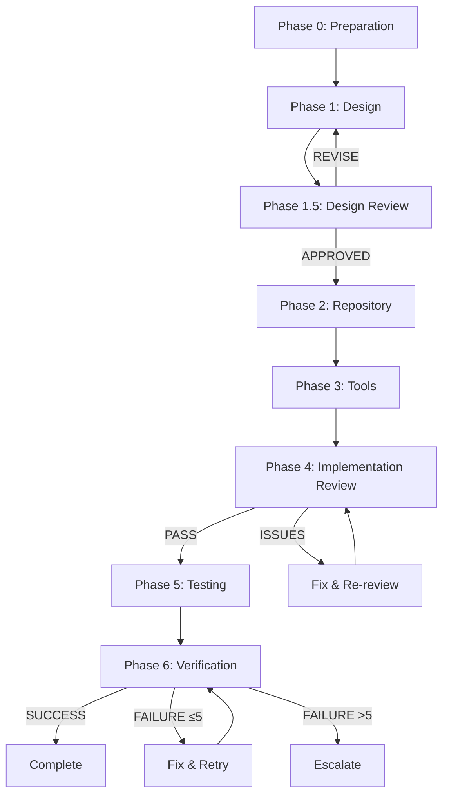

# Final Sub Agent Implementation Plan

> **Base**: Original agent-plan.md + integrated analysis results from agent-enhance-plan.md
>
> **Key Improvements**: File conflict prevention, explicit data transfer, enhanced quality verification

---

## Project Goal

Expand the TossPayments-specific MCP server to a universal library MCP server

### Required Implementation Items (docs/goal.md)
1. Add `get-library-list` tool
2. Remove `get-v1-documents` tool
3. Change `get-v2-documents` → `get-documents` + add libraryId parameter
4. Add libraryId parameter to `document-by-id`
5. Make `createTossPaymentDocsRepository` universal to support all libraries

### Library Configuration Structure
```typescript
interface LibraryConfig {
  id: string;           // Library identifier
  llmsTxtUrl: string;   // llms.txt file URL
}
```

---

## Execution Strategy Summary

### Changes (v1 → v2)

| Item | v1 (Original) | v2 (Final) | Reason |
|-----|----------|----------|------|
| Phase Structure | 3 Phases | 6 Phases | Added verification stages |
| Number of Agents | 7 | 7 | Same (roles redistributed) |
| Execution Method | Parallel + Sequential | Completely Sequential | File conflict prevention |
| Data Transfer | Implicit | agent-outputs/ system | Explicit transfer |
| Design Verification | ❌ | Phase 1.5 added | Quality assurance |
| Implementation Verification | ❌ | Phase 4 added | Correctness assurance |
| Agent 6 Model | Haiku | Sonnet | Improved test quality |
| Total Time | 13-23 min | 48-53 min | +25-40 min (safety) |
| Total Cost | $17 | $30.50 | +$13.50 (prevent rework) |

### Key Improvement Principles

1. **Safety First**: Minimize parallel execution, eliminate conflicts with sequential execution
2. **Explicit Transfer**: Clear data transfer through agent-outputs/ directory
3. **Quality Verification**: Early error detection through design/implementation verification stages
4. **Failure Recovery**: Safety net through Git checkpoints + retry logic

---

## Phase Structure



---

## Phase 0: Preparation

**Executor**: Main session
**Estimated Time**: 1 minute

### Objective
Analyze entire codebase and prepare work environment

### Work Steps

```bash
# 1. Analyze codebase
npx repomix --ignore "./**/*.md"

# 2. Create output directory
mkdir -p agent-outputs

# 3. Git checkpoint
git add .
git commit -m "chore: pre-agent-execution checkpoint"
```

### Deliverables
- ✅ `repomix-output.xml` (approx. 23,619 tokens)
- ✅ `agent-outputs/` directory
- ✅ Git commit (rollback point)

---

## Phase 1: Design

**Agent**: Agent 1 - Design Architect
**모델**: Sonnet
**타입**: Plan (medium)
**예상 시간**: 8분

### 프롬프트

```markdown
You have access to the full codebase in repomix-output.xml.

Design a multi-library system that generalizes the current tosspayments-only MCP server.

## Context

Read repomix-output.xml to understand:
1. Current tool structure (src/tool/tools.ts:1-109)
2. Current repository pattern (src/repository/*.ts)
3. MCP server setup (src/bin/cli.ts)
4. Test patterns (src/**/__test__/*.test.ts)
5. llms.txt parsing logic (src/document/parseLLMText.ts)

## Requirements (from docs/goal.md)

Implement these 5 changes:

1. **Add get-library-list tool**
   - Input: None
   - Output: Array of library IDs
   - Example: ["tosspayments", "supabase", "clerk"]

2. **Remove get-v1-documents tool**
   - Delete function and MCP registration

3. **Rename get-v2-documents → get-documents**
   - Add libraryId parameter
   - Keep same search functionality

4. **Add libraryId to document-by-id tool**
   - Select correct repository based on libraryId

5. **Generalize createTossPaymentDocsRepository**
   - Accept libraryId and llmsTxtUrl
   - Support multiple libraries

## Library Configuration Structure

```typescript
interface LibraryConfig {
  id: string;           // Identifier (e.g., "tosspayments")
  llmsTxtUrl: string;   // URL to llms.txt file
}

// Example
const libraries: LibraryConfig[] = [
  { id: "tosspayments", llmsTxtUrl: "https://docs.tosspayments.com/llms.txt" },
  { id: "supabase", llmsTxtUrl: "https://supabase.com/llms.txt" }
];
```

## Design Constraints

### 1. MCP Pattern Compliance
- Follow @modelcontextprotocol/sdk conventions (see cli.ts)
- Tool registration pattern: `server.tool(name, description, schema, handler)`
- Error handling: Return `{ content: [...], isError: true }` on failure

### 2. llms.txt Format Understanding
- Study parseLLMText.ts to understand parsing logic
- Each library's llms.txt follows same format
- Documents have metadata (title, description, keywords)

### 3. Backward Compatibility (CRITICAL)
- **Must preserve v1/v2 distinction for tosspayments**
- Existing get-v1-documents, get-v2-documents should still work
- Default behavior: libraryId="tosspayments" if omitted (for legacy support)
- Existing user code must not break

### 4. Repository Architecture
- Maintain current DocsRepository class structure
- BM25 search algorithm unchanged
- Token estimation logic unchanged
- v1/v2 document separation unchanged (per library)

### 5. Type Safety
- Full TypeScript strict mode compliance
- Use Zod for schema validation
- No `any` types
- Proper error types

### 6. Error Handling Requirements
| Scenario | Expected Behavior |
|----------|------------------|
| Invalid libraryId | Return clear error: "Library '{id}' not found. Available: [...]" |
| Failed llms.txt fetch | Partial initialization: log error, continue with other libraries |
| Empty document list | Return empty result (not error) |
| Concurrent requests | Thread-safe repository cache |

### 7. Extensibility Goal
**Adding a new library should require ZERO code changes**
- Only configuration file modification
- No if/else for specific library names in logic
- Generic repository initialization

## Output Format

Create `agent-outputs/phase1-design.md` with these sections:

### 1. Architecture Overview
```
[Mermaid diagram or ASCII art showing component interactions]
- User → MCP Tools → Repository Manager → DocsRepository instances
- Configuration loading flow
- Data flow for multi-library queries
```

### 2. Type Definitions
```typescript
// Complete, copy-pasteable TypeScript definitions

// Library configuration
interface LibraryConfig { /* ... */ }

// Repository manager (if needed)
interface RepositoryManager { /* ... */ }

// Updated tool schemas
interface GetDocumentsParams { /* ... */ }

// etc.
```

### 3. Library Configuration Management
```typescript
// Where to store: Recommend src/config/libraries.ts
// Validation: Zod schema

import { z } from 'zod';

export const LibraryConfigSchema = z.object({
  id: z.string().min(1),
  llmsTxtUrl: z.string().url()
});

export const libraries: LibraryConfig[] = [
  // Initial list
];
```

**Decision: Hardcoded array vs. JSON file**
- Recommendation: Hardcoded TypeScript array (libraries.ts)
- Reason: Type safety, no runtime file I/O, easy to version control
- Future: Can add JSON loading if needed

### 4. Repository Changes

#### 4.1 createDocsRepository Refactoring
**Current**:
```typescript
async function createDocsRepository(link = "https://docs.tosspayments.com/llms.txt")
```

**Proposed**:
```typescript
async function createDocsRepository(
  libraryId: string,
  llmsTxtUrl: string
): Promise<DocsRepository>
```

#### 4.2 Initialization Strategy
**Option A: Eager (all libraries at startup)**
- Pros: Fast tool response, fail-fast if config error
- Cons: Slow startup, memory usage

**Option B: Lazy (on first request)**
- Pros: Fast startup, memory efficient
- Cons: First request slow, delayed error detection

**Recommendation**: [Choose and justify]

#### 4.3 Caching Strategy
```typescript
// Example: In-memory cache
const repositoryCache = new Map<string, DocsRepository>();

async function getOrCreateRepository(libraryId: string): Promise<DocsRepository> {
  // Implementation
}
```

#### 4.4 Error Handling for Partial Failure
```typescript
// If one library fails initialization
// Strategy: Continue with others, log error
// User gets error only when requesting failed library
```

### 5. Tool Changes Specification

#### 5.1 NEW: get-library-list
```typescript
interface GetLibraryListOutput {
  libraries: Array<{
    id: string;
    available: boolean;  // false if initialization failed
  }>;
}

async function getLibraryList(): Promise<CallToolResult> {
  // Implementation outline
}
```

#### 5.2 MODIFIED: get-documents (renamed from get-v2-documents)
```typescript
interface GetDocumentsParams {
  libraryId: string;     // NEW parameter
  keywords: string[];
  searchMode?: SearchMode;
  maxTokens?: number;
}

async function getDocuments(params: GetDocumentsParams): Promise<CallToolResult> {
  // Implementation outline
}
```

#### 5.3 MODIFIED: document-by-id
```typescript
interface GetDocumentByIdParams {
  libraryId: string;     // NEW parameter
  id: string;
}

async function getDocumentById(params: GetDocumentByIdParams): Promise<CallToolResult> {
  // Implementation outline
}
```

#### 5.4 REMOVED: get-v1-documents
- Delete function from tools.ts
- Remove registration from cli.ts
- **Backward compatibility plan**: [Specify if deprecation warning needed]

#### 5.5 Backward Compatibility Strategy
**For existing tosspayments users**:
- Keep get-v1-documents and get-v2-documents as aliases?
- Or force migration with clear error message?
- Default libraryId behavior in get-documents?

**Recommendation**: [Choose and justify]

### 6. File Modification Plan

**Files to Create**:
- [ ] `src/config/libraries.ts` - Library configuration array + types

**Files to Modify**:
- [ ] `src/repository/createDocsRepository.ts` - Add libraryId, llmsTxtUrl params
- [ ] `src/tool/tools.ts` - All tool changes
- [ ] `src/bin/cli.ts` - Tool registration changes
- [ ] `src/schema/get-document-schema.ts` - Add libraryId to schema

**Files to Review** (may need changes):
- [ ] `src/repository/docs.repository.ts` - Check if libraryId property needed
- [ ] `src/document/types.ts` - Check if new types needed

### 7. Migration Strategy

#### For Existing Users (Backward Compatibility)
**Scenario 1: User has hardcoded tool calls**
```typescript
// Existing code
await mcp.call("get-v2-documents", { keywords: ["payment"] })

// Options:
// A) Still works (alias remains)
// B) Deprecated warning
// C) Error with migration guide
```

**Scenario 2: User wants multi-library features**
```typescript
// New usage
await mcp.call("get-documents", {
  libraryId: "supabase",
  keywords: ["auth"]
})
```

**Recommendation**: [Specify migration path]

### 8. Error Scenarios & Handling

| Scenario | Detection Point | Handling Strategy | User Experience |
|----------|----------------|-------------------|-----------------|
| Invalid libraryId in tool call | Tool function | Return error result | Clear error message with available IDs |
| llms.txt fetch fails (network) | Repository init | Log error, mark unavailable | Error on first use of that library |
| llms.txt malformed | parseLLMText | Throw error, catch in init | Same as network failure |
| Empty document list after parse | Repository init | Succeed with empty repo | Return "no results" on queries |
| Concurrent same-library requests | Repository cache | Use existing instance | Transparent to user |

### 9. Test Requirements

List test files to create/modify:

**New Test Files**:
- `src/config/__test__/libraries.test.ts` - Config validation tests
- `src/repository/__test__/multi-library.integration.test.ts` - Multi-library scenarios
- `src/tool/__test__/backward-compatibility.test.ts` - Legacy API tests

**Modified Test Files**:
- `src/tool/__test__/tools.test.ts` - Add libraryId parameter tests
- `src/repository/__test__/createDocsRepository.test.ts` - Update for new signature

**Test Coverage Requirements**:
- Unit tests: All new/modified functions
- Integration tests: Cross-library queries, concurrent access
- Backward compatibility: Existing tosspayments workflows
- Error handling: All scenarios from section 8
- E2E (optional): Real llms.txt fetch (skip in CI)

### 10. Implementation Sequence Recommendation

**Phase 2**: Repository layer first (foundational)
**Phase 3**: Tool layer second (depends on repository)
**Phase 5**: Tests third (depends on implementation)

**Rationale**: Repository is core infrastructure, tools are interface

## Quality Checklist (Self-Review)

Before finalizing, verify:

- [ ] All 5 requirements from docs/goal.md explicitly addressed
- [ ] Backward compatibility strategy defined and justified
- [ ] Type definitions complete and compilable
- [ ] Error handling covers all scenarios
- [ ] Zero code change needed for adding new library (verified)
- [ ] File modification plan is exhaustive
- [ ] Test strategy covers critical paths
- [ ] Ambiguities resolved (no "TBD" or "maybe")
- [ ] Code examples provided for complex parts
- [ ] Migration guide clear for existing users

## Deliverable

Save complete design to: `agent-outputs/phase1-design.md`

Format: Markdown with code blocks, tables, and diagrams as above.
```

### 검증 기준
- ✅ 모든 5개 요구사항 명시적 해결
- ✅ 하위 호환성 전략 구체화
- ✅ 타입 정의 완전성
- ✅ 에러 처리 망라
- ✅ 확장성 검증 (새 라이브러리 추가 시 코드 변경 불필요)

### 결과물
- ✅ `agent-outputs/phase1-design.md`

---

## Phase 1.5: Design Review

**Agent**: Agent 2 - Design Reviewer
**모델**: Sonnet
**타입**: General-purpose
**예상 시간**: 4분

### 프롬프트

```markdown
Review the design document from Phase 1 against quality criteria.

## Input

Read `agent-outputs/phase1-design.md`

## Review Checklist

### ✅ Completeness
- [ ] All 5 requirements from docs/goal.md addressed
- [ ] Each requirement has implementation specification
- [ ] File modification plan includes all necessary files
- [ ] Test strategy covers all changes

### ✅ Type Safety
- [ ] libraryId has proper type (validated string, not plain any)
- [ ] All tool schemas include libraryId with Zod validation
- [ ] Repository methods have correct TypeScript signatures
- [ ] No `any` types in interfaces
- [ ] Generic types used correctly

### ✅ Extensibility
- [ ] New library addition = config change only (zero code logic changes)
- [ ] Library config in separate module (src/config/libraries.ts)
- [ ] Config has validation (Zod schema present)
- [ ] No hardcoded library names in business logic
- [ ] Repository initialization is generic

### ✅ Backward Compatibility
- [ ] Existing tosspayments users need zero migration (or clear path provided)
- [ ] v1/v2 tool distinction preserved (or deprecation plan)
- [ ] Default libraryId behavior specified
- [ ] Migration guide section present and clear

### ✅ Error Handling
- [ ] Invalid libraryId error message is user-friendly
- [ ] Failed llms.txt fetch doesn't crash entire server
- [ ] Partial initialization strategy defined
- [ ] All error scenarios in section 8 have handling
- [ ] Error messages don't leak internal details

### ✅ Architecture Quality
- [ ] Repository pattern maintained (DocsRepository class)
- [ ] Caching strategy defined (eager vs lazy justified)
- [ ] Initialization strategy has pros/cons analysis
- [ ] MCP SDK patterns followed correctly
- [ ] Separation of concerns (config/repo/tool layers)

### ✅ Implementation Clarity
- [ ] Code examples are complete and compilable
- [ ] Interface contracts are explicit
- [ ] Ambiguities resolved (no "TBD", "maybe", or "to be decided")
- [ ] Enough detail for implementation without guesswork
- [ ] Complex parts have pseudocode or examples

## Review Process

### Step 1: Read Design Document
Carefully read entire `phase1-design.md`

### Step 2: Check Each Criterion
Go through checklist above, mark ✅ or ❌

### Step 3: Identify Issues
For each ❌, document:
- **What's wrong**: Specific problem
- **Where**: Section in design.md
- **Why it matters**: Impact on implementation
- **How to fix**: Concrete recommendation

### Step 4: Categorize Severity
- **Critical**: Blocks implementation (e.g., missing requirement, type error)
- **High**: Causes incorrect implementation (e.g., wrong pattern)
- **Medium**: Reduces quality (e.g., unclear spec)
- **Low**: Minor improvement (e.g., better example)

### Step 5: Make Decision
- **APPROVED**: All critical and high issues resolved → Proceed to Phase 2
- **REVISE**: Critical or high issues found → List them, restart Agent 1
- **ESCALATE**: Fundamental design question needs main session decision

## Output Format

Create `agent-outputs/phase1-review.md`:

```markdown
# Design Review Report

## Review Result: [APPROVED / REVISE / ESCALATE]

## Checklist Results

### Completeness
- [✅/❌] All 5 requirements addressed
- [✅/❌] Each requirement has specification
- [✅/❌] File modification plan complete
- [✅/❌] Test strategy covers changes

### Type Safety
- [✅/❌] libraryId properly typed
- [✅/❌] Tool schemas include libraryId
- [✅/❌] Repository methods typed correctly
- [✅/❌] No `any` types
- [✅/❌] Generics used correctly

### Extensibility
- [✅/❌] New library = config only
- [✅/❌] Config in separate module
- [✅/❌] Config has validation
- [✅/❌] No hardcoded library names
- [✅/❌] Generic repository init

### Backward Compatibility
- [✅/❌] Zero migration needed (or path clear)
- [✅/❌] v1/v2 distinction preserved
- [✅/❌] Default libraryId specified
- [✅/❌] Migration guide present

### Error Handling
- [✅/❌] Invalid libraryId handled
- [✅/❌] Fetch failure doesn't crash
- [✅/❌] Partial init strategy defined
- [✅/❌] All scenarios covered
- [✅/❌] No internal detail leaks

### Architecture Quality
- [✅/❌] Repository pattern maintained
- [✅/❌] Caching strategy defined
- [✅/❌] Init strategy justified
- [✅/❌] MCP patterns followed
- [✅/❌] Separation of concerns

### Implementation Clarity
- [✅/❌] Code examples complete
- [✅/❌] Interface contracts explicit
- [✅/❌] No ambiguities
- [✅/❌] Detail sufficient
- [✅/❌] Complex parts explained

## Issues Found

### Critical Issues (MUST fix before implementation)
[If none, write "None"]

1. **[Issue Title]**
   - Location: Section X in phase1-design.md
   - Problem: [Specific description]
   - Impact: [Why this blocks implementation]
   - Fix: [Concrete recommendation]

### High Priority Issues (SHOULD fix)
[If none, write "None"]

1. **[Issue Title]**
   - Location: Section X
   - Problem: [Description]
   - Impact: [Why this matters]
   - Fix: [Recommendation]

### Medium Priority Issues (Consider fixing)
[If none, write "None"]

### Low Priority Issues (Optional improvements)
[If none, write "None"]

## Design Strengths
[List 2-3 things the design does well]

## Recommendations for Implementation
[Any advice for Agents 3 and 4]

## Decision Rationale

[Explain why APPROVED / REVISE / ESCALATE]

If REVISE:
- Agent 1 should restart with this feedback
- Focus on fixing [X critical issues]

If ESCALATE:
- Question for main session: [Specific question]
- Context: [Why this needs human decision]
- Options: [A / B / C]
```

## Decision Logic

```python
if critical_issues > 0 or high_issues > 3:
    return "REVISE"
elif fundamental_ambiguity:
    return "ESCALATE"
else:
    return "APPROVED"
```

## Deliverable

Save review to: `agent-outputs/phase1-review.md`
```

### 의사결정 흐름
- **APPROVED** → Phase 2 진행
- **REVISE** → Agent 1 재실행 (피드백 포함)
- **ESCALATE** → 메인 세션에 질문

### 결과물
- ✅ `agent-outputs/phase1-review.md`

---

## Phase 2: Repository Implementation

**Agent**: Agent 3 - Repository Engineer
**모델**: Sonnet
**타입**: General-purpose
**전제조건**: Phase 1.5에서 APPROVED
**예상 시간**: 8분

### 프롬프트

```markdown
Implement repository layer changes based on approved design.

## Prerequisites

Verify Phase 1.5 approved:
- Read `agent-outputs/phase1-review.md`
- Confirm: Review Result = APPROVED
- If not APPROVED, STOP and escalate

## Input Documents

1. `agent-outputs/phase1-design.md` - Approved design specification
2. `repomix-output.xml` - Current codebase (for reference)

## Implementation Tasks

### Task 1: Create Library Configuration Module

**File**: `src/config/libraries.ts` (NEW)

**Content** (based on design section 3):
```typescript
import { z } from 'zod';

// Zod schema for validation
export const LibraryConfigSchema = z.object({
  id: z.string().min(1, "Library ID cannot be empty"),
  llmsTxtUrl: z.string().url("Invalid URL format")
});

export type LibraryConfig = z.infer<typeof LibraryConfigSchema>;

// Library registry
export const libraries: LibraryConfig[] = [
  {
    id: "tosspayments",
    llmsTxtUrl: "https://docs.tosspayments.com/llms.txt"
  }
  // Future libraries added here
];

// Validation helper
export function validateLibraryConfig(config: unknown): LibraryConfig {
  return LibraryConfigSchema.parse(config);
}

// Lookup helper
export function getLibraryConfig(libraryId: string): LibraryConfig | undefined {
  return libraries.find(lib => lib.id === libraryId);
}
```

**Note**: Adapt to design specifications from phase1-design.md section 3

### Task 2: Refactor createDocsRepository

**File**: `src/repository/createDocsRepository.ts` (MODIFY)

**Current Signature**:
```typescript
export async function createDocsRepository(
  link = "https://docs.tosspayments.com/llms.txt"
): Promise<DocsRepository>
```

**New Signature** (from design section 4):
```typescript
export async function createDocsRepository(
  libraryId: string,
  llmsTxtUrl: string
): Promise<DocsRepository>
```

**Changes**:
1. Replace `link` parameter with `libraryId` and `llmsTxtUrl`
2. Keep all existing logic (fetch, parse, load)
3. Add error handling:
   ```typescript
   if (!response.ok) {
     throw new Error(
       `Failed to fetch llms.txt for library '${libraryId}': ${response.statusText}`
     );
   }
   ```
4. Maintain return type: `Promise<DocsRepository>`

**Implementation**:
```typescript
import { CategoryWeightCalculator } from "../document/category-weight-calculator.js";
import { MarkdownDocumentFetcher } from "../document/markdown-document.fetcher.js";
import { parseLLMText } from "../document/parseLLMText.js";
import { DocumentLoader } from "../document/document.loader.js";
import { DocsRepository } from "./docs.repository.js";
import { SynonymDictionary } from "../document/synonym-dictionary.js";

export async function createDocsRepository(
  libraryId: string,
  llmsTxtUrl: string
): Promise<DocsRepository> {
  const response = await fetch(llmsTxtUrl, {
    headers: {
      "user-agent": "Package7MCP",
    },
  });

  if (!response.ok) {
    throw new Error(
      `Failed to fetch llms.txt for library '${libraryId}': ${response.statusText}`
    );
  }

  const llmText = await response.text();

  const rawDocs = parseLLMText(llmText);

  const loader = new DocumentLoader(
    rawDocs,
    new MarkdownDocumentFetcher()
  );

  await loader.load();

  const documents = loader.getDocuments();

  return new DocsRepository(
    documents,
    new CategoryWeightCalculator(),
    new SynonymDictionary()
  );
}
```

### Task 3: Create Repository Manager (if in design)

**Check design section 4.2 and 4.3**: Does design specify a repository manager or caching layer?

**If YES** (eager initialization):
```typescript
// File: src/repository/repository-manager.ts (NEW)

import { DocsRepository } from "./docs.repository.js";
import { createDocsRepository } from "./createDocsRepository.js";
import { libraries } from "../config/libraries.js";

class RepositoryManager {
  private cache = new Map<string, DocsRepository>();
  private initializationErrors = new Map<string, Error>();

  async initializeAll(): Promise<void> {
    const promises = libraries.map(async (lib) => {
      try {
        const repo = await createDocsRepository(lib.id, lib.llmsTxtUrl);
        this.cache.set(lib.id, repo);
      } catch (error) {
        console.error(`Failed to initialize library '${lib.id}':`, error);
        this.initializationErrors.set(lib.id, error as Error);
      }
    });

    await Promise.allSettled(promises);
  }

  getRepository(libraryId: string): DocsRepository | undefined {
    return this.cache.get(libraryId);
  }

  hasError(libraryId: string): boolean {
    return this.initializationErrors.has(libraryId);
  }

  getError(libraryId: string): Error | undefined {
    return this.initializationErrors.get(libraryId);
  }

  getAvailableLibraries(): string[] {
    return Array.from(this.cache.keys());
  }
}

export const repositoryManager = new RepositoryManager();
```

**If NO** (lazy initialization):
```typescript
// File: src/repository/repository-cache.ts (NEW)

import { DocsRepository } from "./docs.repository.js";
import { createDocsRepository } from "./createDocsRepository.js";
import { getLibraryConfig } from "../config/libraries.js";

const cache = new Map<string, Promise<DocsRepository>>();

export async function getOrCreateRepository(
  libraryId: string
): Promise<DocsRepository> {
  // Check cache
  if (cache.has(libraryId)) {
    return cache.get(libraryId)!;
  }

  // Get config
  const config = getLibraryConfig(libraryId);
  if (!config) {
    throw new Error(
      `Library '${libraryId}' not found. Available libraries: ${getAvailableLibraryIds().join(", ")}`
    );
  }

  // Create and cache
  const promise = createDocsRepository(config.id, config.llmsTxtUrl);
  cache.set(libraryId, promise);

  return promise;
}

export function getAvailableLibraryIds(): string[] {
  return libraries.map(lib => lib.id);
}
```

**Follow design specification** from section 4.2

### Task 4: Update DocsRepository (if needed)

**File**: `src/repository/docs.repository.ts`

**Check design section 4**: Does DocsRepository need a libraryId property?

**If YES**:
```typescript
export class DocsRepository {
  constructor(
    private readonly libraryId: string,  // NEW
    private readonly documents: Document[],
    private readonly categoryWeightCalculator: CategoryWeightCalculator,
    private readonly synonymDictionary: SynonymDictionary
  ) {
    // ... rest unchanged
  }

  getLibraryId(): string {
    return this.libraryId;
  }

  // ... rest of methods unchanged
}
```

**Update createDocsRepository call**:
```typescript
return new DocsRepository(
  libraryId,  // NEW parameter
  documents,
  new CategoryWeightCalculator(),
  new SynonymDictionary()
);
```

**If NO**: No changes to this file

### Task 5: Update Type Definitions (if needed)

**File**: `src/document/types.ts` or new `src/types/library.ts`

Check design section 2 for new types needed.

## Implementation Guidelines

### Code Style
- Match existing conventions (see docs.repository.ts)
- Use async/await (not .then())
- Proper error handling in try/catch
- JSDoc comments on public functions

### TypeScript
- Strict mode compliance
- No `any` types
- Explicit return types on functions
- Import types explicitly

### Error Messages
```typescript
// GOOD
throw new Error(`Library '${libraryId}' not found. Available: ${available.join(", ")}`);

// BAD
throw new Error("Library not found");
```

### Backward Compatibility
- Do NOT break createDocsRepository calls in tools.ts yet
- That will be fixed in Phase 3
- Just change the signature and implementation

## Verification Checklist

Before completing, verify:

- [ ] All files from design section 6 "Files to Create" are created
- [ ] All files from design section 6 "Files to Modify" are modified
- [ ] TypeScript compiles: Run `tsc --noEmit`
- [ ] All changes match design specifications exactly
- [ ] JSDoc comments added to public functions
- [ ] Error handling matches design section 8
- [ ] No console.log (use proper error throwing/returning)

## Self-Documentation

Create `agent-outputs/agent3-checklist.md`:

```markdown
# Agent 3 Implementation Checklist

## Files Created
- [ ] src/config/libraries.ts - Library configuration

[List others if created]

## Files Modified
- [ ] src/repository/createDocsRepository.ts - Added libraryId, llmsTxtUrl params

[List others if modified]

## Implementation Decisions
- Initialization strategy: [Eager / Lazy] (from design)
- Caching approach: [Description]
- Error handling: [Partial failure allowed / All-or-nothing]

## Verification Results
- TypeScript compile: [✅ PASS / ❌ FAIL with errors]
- Design compliance: [✅ All specs followed / ⚠️ Deviations: ...]
- Backward compat: [✅ Old calls will break as expected / ❌ Issue: ...]

## Notes for Phase 3
- tools.ts needs to call new createDocsRepository signature
- Repository manager initialized in [location]
- Cache access via [function/class]
```

## Deliverables

1. Modified/created files as specified in design
2. `agent-outputs/agent3-checklist.md`
3. TypeScript must compile (tsc --noEmit)

## Important Notes

- **DO NOT** modify tools.ts yet (Phase 3 will handle)
- **DO NOT** modify cli.ts yet (Phase 3 will handle)
- Focus only on repository layer
- Follow design exactly; if ambiguous, escalate to main session
```

### 결과물
- ✅ `src/config/libraries.ts` (새 파일)
- ✅ 수정된 `src/repository/createDocsRepository.ts`
- ✅ 수정된 `src/repository/docs.repository.ts` (필요 시)
- ✅ 새 repository manager 파일 (설계에 따라)
- ✅ `agent-outputs/agent3-checklist.md`

---

## Phase 3: Tool Implementation

**Agent**: Agent 4 - Tool Engineer
**모델**: Sonnet
**타입**: General-purpose
**전제조건**: Phase 2 완료
**예상 시간**: 7분

### 프롬프트

```markdown
Implement MCP tool layer changes based on approved design and completed repository layer.

## Prerequisites

Verify Phase 2 completed:
- Read `agent-outputs/agent3-checklist.md`
- Confirm TypeScript compile status = PASS
- Review repository changes made

## Input Documents

1. `agent-outputs/phase1-design.md` - Tool specifications (section 5)
2. Repository implementation from Phase 2
3. Current tools.ts and cli.ts

## Implementation Tasks

### Task 1: Update Imports and Repository Initialization

**File**: `src/tool/tools.ts` (MODIFY)

**Current**:
```typescript
import { createDocsRepository } from "../repository/createDocsRepository.js";

export const repository = await createDocsRepository();
```

**New** (adapt based on Phase 2 implementation):

**If eager initialization**:
```typescript
import { repositoryManager } from "../repository/repository-manager.js";

// Initialize at startup
await repositoryManager.initializeAll();
```

**If lazy initialization**:
```typescript
import { getOrCreateRepository, getAvailableLibraryIds } from "../repository/repository-cache.js";

// No startup initialization needed
```

**Follow Phase 2 architecture** from agent3-checklist.md

### Task 2: Add get-library-list Tool

**File**: `src/tool/tools.ts` (ADD)

**Specification** from design section 5.1:

```typescript
/**
 * Returns the list of available libraries.
 *
 * @returns List of library IDs and their availability status
 */
export async function getLibraryList(): Promise<CallToolResult> {
  try {
    const libraries = getAvailableLibraryIds(); // Adjust to Phase 2 API

    const result = libraries.map((id) => {
      const available = repositoryManager.getRepository(id) !== undefined; // Adjust
      return `- ${id}: ${available ? "✅ Available" : "❌ Unavailable"}`;
    }).join("\n");

    return {
      content: [{
        type: "text",
        text: `Available libraries:\n\n${result}`
      }]
    };
  } catch (e) {
    return {
      content: [{
        type: "text",
        text: isNativeError(e) ? e.message : "Failed to retrieve library list"
      }],
      isError: true
    };
  }
}
```

**Adapt** to repository manager API from Phase 2

**Register in cli.ts**:
```typescript
server.tool(
  "get-library-list",
  "Returns the list of available libraries for documentation queries.",
  {},  // No parameters
  async () => getLibraryList()
);
```

### Task 3: Remove get-v1-documents Tool

**File**: `src/tool/tools.ts` (DELETE)

Delete function:
```typescript
export async function getV1DocumentsByKeyword(
  params: GetDocumentParams
): Promise<CallToolResult> {
  // DELETE THIS ENTIRE FUNCTION
}
```

**File**: `src/bin/cli.ts` (REMOVE)

Remove tool registration:
```typescript
server.tool("get-v1-documents", `V1 documents를 조회합니다...`, ...);
// DELETE THIS LINE
```

### Task 4: Rename and Modify get-v2-documents → get-documents

**File**: `src/schema/get-document-schema.ts` (MODIFY)

**Current**:
```typescript
export const GetDocumentSchema = {
  keywords: z.array(z.string()).describe("검색 키워드"),
  searchMode: z.enum(["broad", "balanced", "precise"]).optional(),
  maxTokens: z.number().optional()
};
```

**New**:
```typescript
export const GetDocumentSchema = {
  libraryId: z.string().describe("라이브러리 ID (예: 'tosspayments', 'supabase')"),
  keywords: z.array(z.string()).describe("검색 키워드"),
  searchMode: z.enum(["broad", "balanced", "precise"]).optional(),
  maxTokens: z.number().optional()
};

export type GetDocumentParams = z.infer<typeof z.object(GetDocumentSchema)>;
```

**File**: `src/tool/tools.ts` (MODIFY)

**Current**:
```typescript
export async function getV2DocumentsByKeyword(
  params: GetDocumentParams
): Promise<CallToolResult> {
  try {
    const { keywords, searchMode, maxTokens = 25000 } = params;
    const text = await repository.findV2DocumentsByKeyword(
      keywords,
      searchMode,
      maxTokens
    );
    // ...
  }
}
```

**New**:
```typescript
/**
 * Searches documents in specified library.
 *
 * @param params - Search parameters including libraryId
 * @returns Search results from the specified library
 */
export async function getDocuments(
  params: GetDocumentParams
): Promise<CallToolResult> {
  try {
    const { libraryId, keywords, searchMode, maxTokens = 25000 } = params;

    // Get repository for library
    const repository = await getOrCreateRepository(libraryId); // Adjust to Phase 2 API

    // Use v2 search (assuming design wants to keep v2 as default)
    const text = await repository.findV2DocumentsByKeyword(
      keywords,
      searchMode,
      maxTokens
    );

    return {
      content: [{ type: "text", text }]
    };
  } catch (e) {
    return {
      content: [{
        type: "text",
        text: isNativeError(e) ? e.message : "오류가 발생하였습니다."
      }],
      isError: true
    };
  }
}
```

**Adapt** repository access to Phase 2 implementation

**File**: `src/bin/cli.ts` (MODIFY)

**Current**:
```typescript
server.tool("get-v2-documents", `V2 documents를 조회합니다...`, GetDocumentSchema, ...);
```

**New**:
```typescript
server.tool(
  "get-documents",
  `Searches and retrieves documents from specified library.\n${BasePrompt}`,
  GetDocumentSchema,
  async (params) => getDocuments(params)
);
```

### Task 5: Update document-by-id Tool

**File**: `src/tool/tools.ts` (MODIFY)

**Current**:
```typescript
export async function getDocumentById(id: string): Promise<CallToolResult> {
  try {
    const numericId = parseInt(id, 10);
    // ...
    const document = repository.findOneById(numericId);
    // ...
  }
}
```

**New**:
```typescript
/**
 * Retrieves full document content by ID from specified library.
 *
 * @param libraryId - Library identifier
 * @param id - Document ID
 * @returns Complete document content
 */
export async function getDocumentById(
  libraryId: string,
  id: string
): Promise<CallToolResult> {
  try {
    const numericId = parseInt(id, 10);

    if (isNaN(numericId)) {
      throw new Error("유효하지 않은 문서 ID입니다.");
    }

    // Get repository for library
    const repository = await getOrCreateRepository(libraryId); // Adjust to Phase 2

    const document = repository.findOneById(numericId);

    if (!document) {
      throw new Error("문서를 찾을 수 없습니다.");
    }

    const chunks = document.getChunks();

    const contents = chunks.map((chunk): { type: "text"; text: string } => ({
      type: "text",
      text: chunk.text,
    }));

    return {
      content: contents,
    };
  } catch (e) {
    return {
      content: [{
        type: "text",
        text: isNativeError(e) ? e.message : "오류가 발생하였습니다."
      }],
      isError: true
    };
  }
}
```

**File**: `src/bin/cli.ts` (MODIFY)

**Current**:
```typescript
server.tool(
  "document-by-id",
  `문서의 원본 ID 로 해당 문서의 전체 내용을 조회합니다.`,
  { id: z.string().describe("문서별 id 값") },
  async ({ id }) => getDocumentById(id)
);
```

**New**:
```typescript
server.tool(
  "document-by-id",
  `문서의 원본 ID 로 해당 문서의 전체 내용을 조회합니다.`,
  {
    libraryId: z.string().describe("라이브러리 ID"),
    id: z.string().describe("문서별 id 값")
  },
  async ({ libraryId, id }) => getDocumentById(libraryId, id)
);
```

### Task 6: Backward Compatibility (if specified in design)

**Check design section 5.5**: Does it require backward compatibility aliases?

**If YES (keep v1/v2 tools for tosspayments)**:

Keep `getV1DocumentsByKeyword` but make it an alias:
```typescript
/**
 * @deprecated Use get-documents with libraryId="tosspayments" instead
 */
export async function getV1DocumentsByKeyword(
  params: Omit<GetDocumentParams, "libraryId">
): Promise<CallToolResult> {
  return getDocuments({ ...params, libraryId: "tosspayments" });
}
```

Register with deprecation warning:
```typescript
server.tool(
  "get-v1-documents",
  `⚠️ DEPRECATED: Use 'get-documents' with libraryId='tosspayments' instead.\n\n${BasePromptForV1}`,
  GetDocumentSchema,
  async (params) => getV1DocumentsByKeyword(params)
);
```

**If NO**: Remove as in Task 3

**Follow design specification** from section 5.5

## Implementation Guidelines

### Error Handling Pattern
```typescript
// GOOD
try {
  const repo = await getOrCreateRepository(libraryId);
  // ... use repo
} catch (e) {
  if (e.message.includes("not found")) {
    return {
      content: [{
        type: "text",
        text: `Library '${libraryId}' not found. Use 'get-library-list' to see available libraries.`
      }],
      isError: true
    };
  }
  // ... other errors
}
```

### Type Safety
```typescript
// Always import types
import type { GetDocumentParams } from "../schema/get-document-schema.js";
import type { CallToolResult } from "@modelcontextprotocol/sdk/types.js";
```

### JSDoc
```typescript
/**
 * Searches documents in specified library using BM25 ranking.
 *
 * @param params - Search parameters
 * @param params.libraryId - Target library identifier
 * @param params.keywords - Search keywords
 * @param params.searchMode - Search mode (broad/balanced/precise)
 * @param params.maxTokens - Maximum tokens in response
 * @returns Search results or error
 *
 * @example
 * ```typescript
 * const result = await getDocuments({
 *   libraryId: "tosspayments",
 *   keywords: ["결제", "카드"],
 *   searchMode: "balanced"
 * });
 * ```
 */
```

## Verification Checklist

Before completing:

- [ ] All 4 tool changes implemented (add, remove, rename, update)
- [ ] Repository access matches Phase 2 API
- [ ] TypeScript compiles: `tsc --noEmit`
- [ ] All tool registrations in cli.ts updated
- [ ] Error messages are user-friendly
- [ ] JSDoc comments added
- [ ] Backward compatibility handled (if required by design)
- [ ] No console.log statements

## Self-Documentation

Create `agent-outputs/agent4-checklist.md`:

```markdown
# Agent 4 Implementation Checklist

## Tool Changes Completed

### 1. get-library-list (NEW)
- [✅/❌] Function implemented in tools.ts
- [✅/❌] Registered in cli.ts
- [✅/❌] Returns available library IDs

### 2. get-v1-documents (REMOVED)
- [✅/❌] Function deleted from tools.ts
- [✅/❌] Registration removed from cli.ts
- OR [✅/❌] Kept as deprecated alias (if design specifies)

### 3. get-documents (RENAMED from get-v2-documents)
- [✅/❌] Function renamed and libraryId added
- [✅/❌] Schema updated with libraryId
- [✅/❌] Registration updated in cli.ts
- [✅/❌] Repository access updated for multi-library

### 4. document-by-id (MODIFIED)
- [✅/❌] libraryId parameter added
- [✅/❌] Schema updated in cli.ts
- [✅/❌] Repository selection based on libraryId

## Integration with Phase 2

- Repository access method: [getOrCreateRepository / repositoryManager.getRepository]
- Initialization: [Eager at startup / Lazy on demand]
- Error handling: [Matches Phase 2 behavior]

## Verification Results

- TypeScript compile: [✅ PASS / ❌ FAIL with errors]
- Design compliance: [✅ All specs followed / ⚠️ Deviations: ...]
- All tools registered: [✅ YES / ❌ Missing: ...]

## Files Modified

- src/tool/tools.ts
- src/bin/cli.ts
- src/schema/get-document-schema.ts

## Notes for Phase 5

- Test multi-library scenarios
- Test invalid libraryId handling
- Test backward compatibility (if applicable)
```

## Deliverables

1. Modified tools.ts with all 4 changes
2. Modified cli.ts with updated registrations
3. Modified get-document-schema.ts with libraryId
4. `agent-outputs/agent4-checklist.md`
5. TypeScript must compile

## Important

- Match Phase 2 repository API exactly
- Follow design section 5 specifications
- Ensure error messages guide users (e.g., suggest get-library-list)
```

### 결과물
- ✅ 수정된 `src/tool/tools.ts`
- ✅ 수정된 `src/bin/cli.ts`
- ✅ 수정된 `src/schema/get-document-schema.ts`
- ✅ `agent-outputs/agent4-checklist.md`

---

## Phase 4: Implementation Review

**Agent**: Agent 5 - Implementation Reviewer
**모델**: Sonnet
**타입**: General-purpose
**전제조건**: Phase 2, 3 완료
**예상 시간**: 5분

### 프롬프트

```markdown
Review Phase 2 and 3 implementations against the approved design.

## Input Documents

1. `agent-outputs/phase1-design.md` - Design specification
2. `agent-outputs/agent3-checklist.md` - Phase 2 self-check
3. `agent-outputs/agent4-checklist.md` - Phase 3 self-check
4. All modified files from Phase 2 and 3

## Review Tasks

### Task 1: Design-Implementation Mapping

For each section in phase1-design.md, verify implementation:

#### Section 3: Library Configuration
- [ ] File `src/config/libraries.ts` exists
- [ ] Contains LibraryConfig type
- [ ] Contains Zod schema
- [ ] Contains libraries array
- [ ] Has validation/lookup helpers

#### Section 4: Repository Changes
- [ ] `createDocsRepository` signature changed to (libraryId, llmsTxtUrl)
- [ ] Initialization strategy from design implemented
- [ ] Caching strategy from design implemented
- [ ] Error handling matches design section 8
- [ ] DocsRepository updated if design specified

#### Section 5: Tool Changes
- [ ] `get-library-list` added
- [ ] `get-v1-documents` removed (or aliased if design specified)
- [ ] `get-v2-documents` renamed to `get-documents`
- [ ] `libraryId` parameter added to get-documents
- [ ] `document-by-id` updated with libraryId
- [ ] All tool registrations in cli.ts updated

#### Section 6: File Modification Plan
- [ ] All files in "Files to Create" created
- [ ] All files in "Files to Modify" modified
- [ ] No unexpected files changed

### Task 2: Integration Points Verification

**Identify where Tool code calls Repository code**:

Read `src/tool/tools.ts` and find all repository calls:

Example locations:
- `getDocuments` function → calls repository.findV2DocumentsByKeyword
- `getDocumentById` function → calls repository.findOneById
- etc.

For each call:
- [ ] Parameter types match Repository interface
- [ ] Return types match
- [ ] Error handling consistent
- [ ] Repository selection based on libraryId works

**Example check**:
```typescript
// In tools.ts
const repository = await getOrCreateRepository(libraryId);
const text = await repository.findV2DocumentsByKeyword(...);

// Check:
// 1. Does getOrCreateRepository exist? (Phase 2)
// 2. Does it return DocsRepository? (Type check)
// 3. Does DocsRepository have findV2DocumentsByKeyword? (Method check)
// 4. Do parameters match? (keywords, searchMode, maxTokens)
```

### Task 3: Type Safety Verification

Run TypeScript compiler:
```bash
tsc --noEmit
```

Expected: **0 errors**

If errors found:
- Document each error
- Categorize: Type mismatch / Missing import / etc.
- Assess: Critical (blocks) / High (incorrect) / Medium (warning)

### Task 4: Backward Compatibility Verification

**Check design section 5.5**: What was the backward compatibility strategy?

Verify:
- [ ] If design kept v1/v2 tools, they still exist
- [ ] If design removed them, they're gone
- [ ] Default libraryId behavior implemented (if specified)
- [ ] Existing tosspayments code path works

**Test mentally**:
```typescript
// Old code (if design preserves it)
getV1DocumentsByKeyword({ keywords: ["payment"] })
// Should still work (or have clear deprecation)

// New code
getDocuments({ libraryId: "tosspayments", keywords: ["payment"] })
// Should work identically to old v2 behavior
```

### Task 5: Code Quality Review

For all modified files:

**Style Consistency**:
- [ ] Matches existing code style (see docs.repository.ts)
- [ ] Proper indentation and formatting
- [ ] No commented-out code
- [ ] No TODO or FIXME comments

**Error Messages**:
- [ ] User-friendly (not technical jargon)
- [ ] Actionable (tell user what to do)
- [ ] Include context (e.g., available library list)

Examples:
```typescript
// GOOD
`Library '${id}' not found. Available: tosspayments, supabase`

// BAD
`Error: undefined library`
```

**JSDoc**:
- [ ] All public functions have JSDoc
- [ ] Parameter descriptions present
- [ ] Return type documented
- [ ] Examples included (where helpful)

**No Debug Code**:
- [ ] No console.log statements
- [ ] No debug imports
- [ ] No commented test code

### Task 6: Error Handling Verification

**Cross-reference with design section 8**:

For each error scenario in design:

| Scenario | Handler Location | Correct? |
|----------|-----------------|----------|
| Invalid libraryId | tools.ts:getDocuments | ✅/❌ |
| Failed llms.txt fetch | createDocsRepository.ts | ✅/❌ |
| Empty document list | (should succeed) | ✅/❌ |
| Concurrent requests | repository cache | ✅/❌ |

Verify error messages match design specifications.

### Task 7: Security Review

**Check for common issues**:

- [ ] URL validation in library config (Zod schema checks)
- [ ] No SSRF vulnerability (fetch only from configured URLs)
- [ ] libraryId sanitized (not used in eval/exec)
- [ ] Error messages don't leak internal paths
- [ ] No sensitive data in logs

Example checks:
```typescript
// GOOD: libraryId from predefined list
const config = getLibraryConfig(libraryId);

// BAD: libraryId used to construct URL
const url = `https://${libraryId}.com/llms.txt`; // SSRF risk
```

## Output Format

Create `agent-outputs/phase4-review.md`:

```markdown
# Implementation Review Report

## Review Result: [PASS / ISSUES_FOUND / CRITICAL]

---

## 1. Design Compliance

### Section 3: Library Configuration
- [✅/❌] File structure correct
- [✅/❌] Types match design
- [✅/❌] Validation implemented

### Section 4: Repository Changes
- [✅/❌] Signature changed correctly
- [✅/❌] Initialization strategy matches
- [✅/❌] Caching strategy matches
- [✅/❌] Error handling complete

### Section 5: Tool Changes
- [✅/❌] All 4 changes implemented
- [✅/❌] Parameters correct
- [✅/❌] Registrations updated

### Section 6: File Modification Plan
- [✅/❌] All planned files modified
- [✅/❌] No unexpected changes

**Overall Design Compliance**: [✅ PASS / ⚠️ PARTIAL / ❌ FAIL]

---

## 2. Integration Points

### Repository Access in Tools

| Tool Function | Repository Call | Status | Notes |
|---------------|----------------|--------|-------|
| getDocuments | findV2DocumentsByKeyword | ✅/❌ | [Notes] |
| getDocumentById | findOneById | ✅/❌ | [Notes] |

**Parameter Type Matching**:
- [✅/❌] All calls use correct types
- [✅/❌] Return types handled correctly

**Overall Integration**: [✅ PASS / ⚠️ ISSUES / ❌ FAIL]

---

## 3. Type Safety

### TypeScript Compilation
```
$ tsc --noEmit

[Paste output here]
```

**Result**: [✅ 0 errors / ❌ X errors]

### Type Errors (if any)
1. **[Error message]**
   - File: [file:line]
   - Severity: [Critical / High / Medium]
   - Fix: [Recommendation]

**Overall Type Safety**: [✅ PASS / ❌ FAIL]

---

## 4. Backward Compatibility

**Strategy from Design**: [Description]

- [✅/❌] v1/v2 tools handled per design
- [✅/❌] Default libraryId behavior correct
- [✅/❌] Existing code path preserved

**Overall Compatibility**: [✅ PASS / ⚠️ CONCERNS / ❌ FAIL]

---

## 5. Code Quality

### Style Consistency
- [✅/❌] Matches existing patterns
- [✅/❌] No commented code
- [✅/❌] No TODO/FIXME

### Error Messages
- [✅/❌] User-friendly
- [✅/❌] Actionable
- [✅/❌] Include context

### JSDoc
- [✅/❌] All public functions documented
- [✅/❌] Parameters described
- [✅/❌] Examples provided

### Debug Code
- [✅/❌] No console.log
- [✅/❌] No debug artifacts

**Overall Code Quality**: [✅ PASS / ⚠️ MINOR ISSUES / ❌ FAIL]

---

## 6. Error Handling

### Scenario Coverage

| Design Scenario | Implementation | Status |
|----------------|----------------|--------|
| Invalid libraryId | [Location] | ✅/❌ |
| Failed llms.txt fetch | [Location] | ✅/❌ |
| Empty document list | [Location] | ✅/❌ |
| Concurrent requests | [Location] | ✅/❌ |

**Overall Error Handling**: [✅ PASS / ⚠️ INCOMPLETE / ❌ FAIL]

---

## 7. Security

- [✅/❌] URL validation present
- [✅/❌] No SSRF vulnerability
- [✅/❌] libraryId sanitized
- [✅/❌] Error messages safe
- [✅/❌] No sensitive data leaks

**Overall Security**: [✅ PASS / ⚠️ CONCERNS / ❌ FAIL]

---

## Issues Found

### Critical Issues (Blocks Phase 5)
[If none, write "None"]

1. **[Issue Title]**
   - File: [file:line]
   - Problem: [Description]
   - Impact: [Why this blocks]
   - Fix: [Specific change needed]

### High Priority Issues (Incorrect implementation)
[If none, write "None"]

### Medium Priority Issues (Quality concerns)
[If none, write "None"]

### Low Priority Issues (Minor improvements)
[If none, write "None"]

---

## Implementation Strengths

[List 2-3 things implemented well]

1.
2.
3.

---

## Decision

**Result**: [PASS / ISSUES_FOUND / CRITICAL]

### If PASS
All checks passed. Proceed to Phase 5 (Testing).

### If ISSUES_FOUND
Issues detected but fixable. Agents should:
- Address [X] critical issues
- Address [Y] high priority issues
- Optionally address medium/low issues

Re-run this review after fixes.

### If CRITICAL
Fundamental problem detected:
- [Describe problem]
- Recommendation: [Escalate / Restart Phase X]

---

## Recommendations for Phase 5

[Any notes for test implementation]

- Focus test coverage on [areas]
- Pay attention to [edge cases]
- Mock strategy for [components]
```

## Decision Logic

```python
if critical_issues > 0:
    return "CRITICAL"
elif high_issues > 0 or medium_issues > 5:
    return "ISSUES_FOUND"
elif type_errors > 0:
    return "CRITICAL"
else:
    return "PASS"
```

## Deliverable

Save to: `agent-outputs/phase4-review.md`
```

### 의사결정 흐름
- **PASS** → Phase 5 진행
- **ISSUES_FOUND** → 수정 후 재검토
- **CRITICAL** → 메인 세션 에스컬레이션

### 결과물
- ✅ `agent-outputs/phase4-review.md`

---

## Phase 5: Testing

**Agent**: Agent 6 - Test Engineer
**모델**: Sonnet (변경: Haiku → Sonnet)
**타입**: General-purpose
**전제조건**: Phase 4 PASS
**예상 시간**: 10분

### 프롬프트

```markdown
Write comprehensive tests for multi-library functionality.

## Prerequisites

Verify Phase 4 passed:
- Read `agent-outputs/phase4-review.md`
- Confirm: Review Result = PASS
- If not PASS, STOP and escalate

## Input Documents

1. `agent-outputs/phase1-design.md` - Section 9 (Test Requirements)
2. All implemented code from Phase 2-3
3. Existing test files for patterns (repomix-output.xml)

## Test Framework

Based on existing tests:
- **Framework**: vitest
- **Pattern**: describe/it blocks
- **Location**: `src/**/__test__/*.test.ts`
- **Mocking**: See chunk-converter.test.ts for examples
- **E2E**: See docs-repository.e2e.test.ts for pattern

## Test Categories

### Category 1: Library Configuration Tests

**File**: `src/config/__test__/libraries.test.ts` (NEW)

```typescript
import { describe, expect, it } from "vitest";
import {
  LibraryConfigSchema,
  libraries,
  getLibraryConfig,
  validateLibraryConfig
} from "../libraries.js";

describe("Library Configuration", () => {
  describe("LibraryConfigSchema validation", () => {
    it("should accept valid configuration", () => {
      const valid = {
        id: "tosspayments",
        llmsTxtUrl: "https://docs.tosspayments.com/llms.txt"
      };

      expect(() => LibraryConfigSchema.parse(valid)).not.toThrow();
    });

    it("should reject empty id", () => {
      const invalid = {
        id: "",
        llmsTxtUrl: "https://example.com/llms.txt"
      };

      expect(() => LibraryConfigSchema.parse(invalid)).toThrow();
    });

    it("should reject invalid URL", () => {
      const invalid = {
        id: "test",
        llmsTxtUrl: "not-a-url"
      };

      expect(() => LibraryConfigSchema.parse(invalid)).toThrow();
    });

    it("should reject missing fields", () => {
      const invalid = { id: "test" };

      expect(() => LibraryConfigSchema.parse(invalid)).toThrow();
    });
  });

  describe("getLibraryConfig", () => {
    it("should find existing library", () => {
      const config = getLibraryConfig("tosspayments");

      expect(config).toBeDefined();
      expect(config?.id).toBe("tosspayments");
    });

    it("should return undefined for non-existent library", () => {
      const config = getLibraryConfig("nonexistent");

      expect(config).toBeUndefined();
    });
  });

  describe("libraries array", () => {
    it("should have at least tosspayments", () => {
      const ids = libraries.map((lib) => lib.id);

      expect(ids).toContain("tosspayments");
    });

    it("should have unique ids", () => {
      const ids = libraries.map((lib) => lib.id);
      const uniqueIds = new Set(ids);

      expect(ids.length).toBe(uniqueIds.size);
    });

    it("should have valid URLs", () => {
      libraries.forEach((lib) => {
        expect(lib.llmsTxtUrl).toMatch(/^https?:\/\/.+/);
      });
    });
  });
});
```

### Category 2: Repository Multi-Library Tests

**File**: `src/repository/__test__/multi-library.integration.test.ts` (NEW)

```typescript
import { describe, expect, it, vi, beforeEach } from "vitest";
import { createDocsRepository } from "../createDocsRepository.js";

// Mock fetch
global.fetch = vi.fn();

describe("Multi-library Repository", () => {
  beforeEach(() => {
    vi.clearAllMocks();
  });

  describe("createDocsRepository", () => {
    it("should accept libraryId and llmsTxtUrl parameters", async () => {
      const mockLlmText = `***
title: Test Doc
description: Test
keyword: test
-----
# Test
https://example.com/doc.md`;

      const mockMarkdown = "# Test Document";

      (global.fetch as any).mockImplementation((url: string) => {
        if (url.includes("llms.txt")) {
          return Promise.resolve({
            ok: true,
            text: () => Promise.resolve(mockLlmText)
          });
        }
        if (url.includes("doc.md")) {
          return Promise.resolve({
            ok: true,
            text: () => Promise.resolve(mockMarkdown)
          });
        }
      });

      const repository = await createDocsRepository(
        "test-library",
        "https://example.com/llms.txt"
      );

      expect(repository).toBeDefined();
      expect(fetch).toHaveBeenCalledWith(
        "https://example.com/llms.txt",
        expect.any(Object)
      );
    });

    it("should throw error for failed llms.txt fetch", async () => {
      (global.fetch as any).mockResolvedValue({
        ok: false,
        statusText: "Not Found"
      });

      await expect(
        createDocsRepository("test", "https://example.com/llms.txt")
      ).rejects.toThrow("Failed to fetch llms.txt for library 'test'");
    });

    it("should include libraryId in error message", async () => {
      (global.fetch as any).mockResolvedValue({
        ok: false,
        statusText: "Internal Server Error"
      });

      await expect(
        createDocsRepository("mylib", "https://example.com/llms.txt")
      ).rejects.toThrow("mylib");
    });
  });

  // Additional tests based on initialization strategy from Phase 2
  // If eager: test initializeAll()
  // If lazy: test getOrCreateRepository()
});
```

**Adapt based on Phase 2 implementation** (eager vs lazy)

### Category 3: Tool Multi-Library Tests

**File**: `src/tool/__test__/tools.test.ts` (MODIFY)

Add new tests to existing file:

```typescript
import { describe, expect, it, vi, beforeAll } from "vitest";
import {
  getLibraryList,
  getDocuments,
  getDocumentById
} from "../tools.js";

// Setup mocks based on Phase 2 implementation

describe("Multi-library Tools", () => {
  describe("getLibraryList", () => {
    it("should return list of available libraries", async () => {
      const result = await getLibraryList();

      expect(result.content).toBeDefined();
      expect(result.content[0].text).toContain("tosspayments");
    });

    it("should not return error", async () => {
      const result = await getLibraryList();

      expect(result.isError).not.toBe(true);
    });
  });

  describe("getDocuments", () => {
    it("should accept libraryId parameter", async () => {
      const params = {
        libraryId: "tosspayments",
        keywords: ["결제", "카드"],
        searchMode: "balanced" as const,
        maxTokens: 10000
      };

      const result = await getDocuments(params);

      expect(result.content).toBeDefined();
    });

    it("should return error for invalid libraryId", async () => {
      const params = {
        libraryId: "nonexistent",
        keywords: ["test"],
        maxTokens: 10000
      };

      const result = await getDocuments(params);

      expect(result.isError).toBe(true);
      expect(result.content[0].text).toContain("not found");
    });

    it("should return error message with available libraries", async () => {
      const params = {
        libraryId: "invalid",
        keywords: ["test"],
        maxTokens: 10000
      };

      const result = await getDocuments(params);

      expect(result.content[0].text).toContain("Available");
    });
  });

  describe("getDocumentById", () => {
    it("should accept libraryId parameter", async () => {
      // Setup: need mock repository with documents
      const result = await getDocumentById("tosspayments", "0");

      // Adjust assertion based on mock data
      expect(result.content).toBeDefined();
    });

    it("should return error for invalid libraryId", async () => {
      const result = await getDocumentById("nonexistent", "0");

      expect(result.isError).toBe(true);
      expect(result.content[0].text).toContain("not found");
    });

    it("should return error for invalid document ID", async () => {
      const result = await getDocumentById("tosspayments", "999999");

      expect(result.isError).toBe(true);
      expect(result.content[0].text).toContain("찾을 수 없습니다");
    });
  });
});
```

### Category 4: Backward Compatibility Tests

**File**: `src/tool/__test__/backward-compatibility.test.ts` (NEW)

**Only if design specified backward compatibility**:

```typescript
import { describe, expect, it } from "vitest";
import {
  getV1DocumentsByKeyword,
  getV2DocumentsByKeyword
} from "../tools.js";

describe("Backward Compatibility", () => {
  describe("get-v1-documents (if preserved)", () => {
    it("should still work for tosspayments", async () => {
      const params = {
        keywords: ["결제"],
        searchMode: "balanced" as const,
        maxTokens: 10000
      };

      const result = await getV1DocumentsByKeyword(params);

      expect(result.content).toBeDefined();
      expect(result.isError).not.toBe(true);
    });

    it("should behave same as getDocuments with libraryId='tosspayments'", async () => {
      const params = {
        keywords: ["카드"],
        searchMode: "balanced" as const,
        maxTokens: 10000
      };

      const oldResult = await getV1DocumentsByKeyword(params);
      const newResult = await getDocuments({
        ...params,
        libraryId: "tosspayments"
      });

      // Results should be similar (may not be identical due to versioning)
      expect(oldResult.isError).toBe(newResult.isError);
    });
  });

  describe("get-v2-documents (if preserved)", () => {
    it("should still work for tosspayments", async () => {
      const params = {
        keywords: ["SDK"],
        searchMode: "balanced" as const,
        maxTokens: 10000
      };

      const result = await getV2DocumentsByKeyword(params);

      expect(result.content).toBeDefined();
      expect(result.isError).not.toBe(true);
    });
  });
});
```

**Skip this file if design removed v1/v2 tools completely**

### Category 5: Integration Tests

**File**: `src/__test__/integration.test.ts` (NEW)

```typescript
import { describe, expect, it } from "vitest";
// Import based on Phase 2 implementation
// import { repositoryManager } from "../repository/repository-manager.js";
// or
// import { getOrCreateRepository } from "../repository/repository-cache.js";

describe("Integration Tests", () => {
  describe("Repository initialization and tool usage", () => {
    it("should initialize and serve tosspayments docs", async () => {
      // This test requires real network or comprehensive mocking
      // Follow the pattern from docs-repository.e2e.test.ts

      // If eager initialization:
      // await repositoryManager.initializeAll();
      // const repo = repositoryManager.getRepository("tosspayments");

      // If lazy initialization:
      // const repo = await getOrCreateRepository("tosspayments");

      // expect(repo).toBeDefined();
      // Test search functionality
    });

    it("should handle concurrent requests to different libraries", async () => {
      // Test thread safety
      // Concurrent calls to getDocuments with different libraryIds
    });
  });
});
```

### Category 6: E2E Tests (Optional)

**File**: `src/__test__/e2e.test.ts` (NEW)

```typescript
import { describe, it } from "vitest";

describe.skip("E2E Tests (Manual)", () => {
  it("should fetch real tosspayments llms.txt and initialize", async () => {
    // Real network call
    // const repo = await createDocsRepository(
    //   "tosspayments",
    //   "https://docs.tosspayments.com/llms.txt"
    // );
    // expect(repo).toBeDefined();
    // Test search functionality with real data
  });

  // Mark as .skip so it doesn't run in CI
  // Run manually for verification
});
```

## Test Data Strategy

### Mock llms.txt Files

Create `src/__test__/data/` directory with mock files:

**File**: `src/__test__/data/mock-tosspayments-llms.txt`
```
***
title: 결제 가이드
description: 토스페이먼츠 결제 가이드
keyword: 결제, 카드, API
-----
# 결제 가이드
https://example.com/payment-guide.md

***
title: SDK 문서
description: SDK 사용법
keyword: sdk, 연동
-----
# SDK
https://example.com/sdk.md
```

**File**: `src/__test__/data/mock-payment-guide.md`
```markdown
# 결제 가이드

토스페이먼츠로 결제를 연동하는 방법입니다.

## 카드 결제

카드 정보를 입력받아 결제를 진행합니다.
```

Use these in tests instead of real URLs.

## Implementation Guidelines

### Mock Strategy
```typescript
// Mock fetch globally
global.fetch = vi.fn((url: string) => {
  if (url.includes("llms.txt")) {
    return Promise.resolve({
      ok: true,
      text: () => Promise.resolve(mockLlmText)
    });
  }
  // ... other mocks
});
```

### Test Structure
```typescript
describe("Feature", () => {
  describe("Sub-feature", () => {
    it("should do something specific", () => {
      // Arrange
      const input = ...;

      // Act
      const result = ...;

      // Assert
      expect(result).toBe(...);
    });
  });
});
```

### Coverage Goals
- Unit tests: 100% of new functions
- Integration tests: All cross-module interactions
- Error paths: All error scenarios from design section 8
- Edge cases: Empty inputs, boundary values, concurrent calls

## Verification Checklist

Before completing:

- [ ] All test files from design section 9 created
- [ ] Tests run successfully: `npm test`
- [ ] Coverage > 80% for new code: `npm run test:coverage`
- [ ] Mock data files created
- [ ] No actual network calls in unit tests (only in E2E skip tests)
- [ ] All error scenarios tested

## Self-Documentation

Create `agent-outputs/agent6-test-summary.md`:

```markdown
# Test Implementation Summary

## Test Files Created

### New Files
- [ ] src/config/__test__/libraries.test.ts
- [ ] src/repository/__test__/multi-library.integration.test.ts
- [ ] src/tool/__test__/backward-compatibility.test.ts (if applicable)
- [ ] src/__test__/integration.test.ts
- [ ] src/__test__/e2e.test.ts (optional, skipped)

### Modified Files
- [ ] src/tool/__test__/tools.test.ts (added multi-library tests)

### Mock Data Files
- [ ] src/__test__/data/mock-tosspayments-llms.txt
- [ ] src/__test__/data/mock-payment-guide.md
- [ ] [List others]

## Test Coverage

### By Category
- Library Configuration: XX tests
- Repository Multi-library: XX tests
- Tool Multi-library: XX tests
- Backward Compatibility: XX tests (or N/A)
- Integration: XX tests
- E2E: XX tests (skipped)

**Total**: XX tests

### By Type
- Unit Tests: XX
- Integration Tests: XX
- E2E Tests: XX (skipped)

## Test Results

```
$ npm test

[Paste output]
```

**Status**: [✅ All Passing / ❌ X failing]

### Failing Tests (if any)
1. **[Test name]**
   - File: [file:line]
   - Error: [Error message]
   - Reason: [Why it's failing]
   - Fix: [Recommendation]

## Coverage Report

```
$ npm run test:coverage

[Paste relevant coverage stats for new files]
```

**New Code Coverage**: [XX%]

### Coverage Gaps (if <80%)
- [File/Function with low coverage]
- [Reason for gap]
- [Additional tests needed]

## Mock Strategy

- Network calls: Mocked globally with vi.fn()
- Repository instances: [Mocked / Real instances with mock data]
- File system: [N/A / Mocked]

## Notes for Phase 6

- All tests passing locally
- Coverage meets 80% threshold
- [Any special notes for verification phase]
```

## Deliverables

1. All test files created/modified
2. Mock data files in `src/__test__/data/`
3. `agent-outputs/agent6-test-summary.md`
4. All tests passing (`npm test`)
5. Coverage report showing >80% for new code

## Important Notes

- Tests must be comprehensive (edge cases, errors, integration)
- Use Sonnet to understand complex scenarios (BM25, concurrent access)
- Follow existing test patterns (see chunk-converter.test.ts)
- Mock external dependencies (network, file system)
- Document any test failures clearly
```

### 결과물
- ✅ 새 테스트 파일들 (6-8개)
- ✅ Mock 데이터 파일들
- ✅ `agent-outputs/agent6-test-summary.md`
- ✅ 모든 테스트 통과

---

## Phase 6: Verification

**Agent**: Agent 7 - Verification Engineer
**모델**: Haiku
**타입**: General-purpose
**전제조건**: Phase 5 완료
**예상 시간**: 5-10분 (반복 포함)

### 프롬프트

```markdown
Run verification checks and fix issues until all pass.

## Prerequisites

Read `agent-outputs/agent6-test-summary.md`

If tests are failing, review failures before proceeding.

## Verification Steps (Execute in Order)

### Step 1: TypeScript Type Check

```bash
tsc --noEmit
```

**Expected**: Zero errors

**If errors**:
- Read error messages carefully
- Categorize: Missing import / Type mismatch / etc.
- Fix systematically
- Re-run this step

### Step 2: Linter (if configured)

```bash
npm run lint
```

**Expected**: Zero errors (warnings acceptable)

**If errors**:
- Fix style issues
- Re-run this step

**If no lint script**: Skip this step

### Step 3: Build Process

```bash
npm run build
```

**Expected**: Build succeeds, `dist/` folder created

**If errors**:
- Check for import path issues
- Check for missing exports
- Fix and re-run

### Step 4: Test Suite

```bash
npm test
```

**Expected**: All tests pass (including Phase 5 tests)

**If failures**:
- Identify which test(s) failed
- Read error messages
- Fix implementation or test
- Re-run this step

### Step 5: Test Coverage (Optional but Recommended)

```bash
npm run test:coverage
```

**Expected**: Coverage >80% for new code

**If low coverage**:
- Identify uncovered lines
- Add tests (return to Phase 5 logic)
- Or accept if edge case

## Retry Logic

**Constraints**:
- Maximum attempts: 5
- Same error 3 times: Escalate

**Process**:
For each failure:
1. Analyze error message
2. Categorize error type
3. Determine if fixable

**Fixable errors** (fix and retry):
- Type errors (missing type, wrong type)
- Import errors (wrong path, missing export)
- Simple logic bugs (off-by-one, null check)
- Test failures (incorrect assertion, mock issue)

**Design issues** (escalate immediately):
- Circular dependency
- Fundamental type system problem
- Test reveals architectural flaw
- Multiple unrelated errors after fix

## Error Categorization Examples

### Fixable

```
Error: Property 'libraryId' does not exist on type 'GetDocumentParams'
→ Add libraryId to type definition
```

```
Error: Cannot find module './libraries.js'
→ Fix import path
```

```
Test failed: Expected 'tosspayments' but got undefined
→ Check mock setup or implementation
```

### Design Issue (Escalate)

```
Error: Circular dependency detected:
  tools.ts → repository-manager.ts → libraries.ts → tools.ts
→ Architecture problem
```

```
Test failed: Backward compatibility broken for existing users
→ Design decision needed
```

```
After fixing type error, 10 new type errors appeared
→ Type system design flaw
```

## Fix Execution

For each error:

1. **Identify root cause** (not just symptom)
2. **Make minimal fix** (don't refactor unrelated code)
3. **Test fix** (re-run failed step only)
4. **Document fix** (for escalation report if needed)

## Output Format

### On Success

Create `agent-outputs/phase6-verification.md`:

```markdown
# Verification Report

## Status: ✅ SUCCESS

All verification checks passed.

---

## Verification Results

### 1. TypeScript Type Check
```bash
$ tsc --noEmit
```
**Result**: ✅ PASS (0 errors)

### 2. Linter
```bash
$ npm run lint
```
**Result**: ✅ PASS (0 errors, X warnings)
[Or: N/A - no lint script]

### 3. Build
```bash
$ npm run build
```
**Result**: ✅ PASS (dist/ created)

### 4. Tests
```bash
$ npm test
```
**Result**: ✅ PASS (XX/XX tests passing)

### 5. Coverage
```bash
$ npm run test:coverage
```
**Result**: XX% coverage for new code
[Or: Skipped]

---

## Retry History

**Total attempts**: X/5

### Fixes Applied
[If no fixes needed, write "None - passed on first attempt"]

1. **[Fix description]**
   - Error: [Original error]
   - Cause: [Root cause]
   - Fix: [What was changed]
   - Result: [Error resolved]

2. [More fixes if any]

---

## Final State

- ✅ All TypeScript errors resolved
- ✅ Linter clean (or warnings only)
- ✅ Build successful
- ✅ All tests passing
- ✅ Coverage acceptable

**Ready for production**: ✅ YES

---

## Git Checkpoint

Creating commit with changes:

```bash
git add .
git commit -m "feat: add multi-library support

- Add get-library-list tool
- Remove get-v1-documents tool
- Rename get-v2-documents to get-documents
- Add libraryId parameter to tools
- Generalize repository for all libraries
- Add comprehensive test coverage

Closes #[issue-number]

🤖 Generated with Claude Code

Co-Authored-By: Claude <noreply@anthropic.com>"
```

**Commit hash**: [hash]
```

### On Failure (Escalation Needed)

Create `agent-outputs/phase6-escalation.md`:

```markdown
# Verification Escalation

## Status: ⚠️ ESCALATION REQUIRED

Unable to resolve issues after [X] attempts.

---

## Critical Issue

**Category**: [Design Issue / Unable to Fix After 3 Attempts]

### Error Details

**Step**: [TypeScript / Build / Test]

**Error Message**:
```
[Full error output]
```

---

## Fix Attempts

### Attempt 1
- **Approach**: [What was tried]
- **Result**: [Still failed / New error appeared]
- **Error**: [Error message]

### Attempt 2
- **Approach**: [What was tried]
- **Result**: [Still failed / New error appeared]
- **Error**: [Error message]

### Attempt 3
- **Approach**: [What was tried]
- **Result**: [Still failed / New error appeared]
- **Error**: [Error message]

[If more attempts, continue...]

---

## Root Cause Analysis

**Diagnosis**: [Why this is unfixable or design issue]

**Examples**:
- Circular dependency indicates architectural problem
- Type errors cascade after each fix → type system design flaw
- Test failure reveals backward compatibility broken by design

---

## Impact Assessment

**Blocks**: [What can't proceed]

**Alternatives**:
1. [Option A] - [Pros/Cons]
2. [Option B] - [Pros/Cons]

---

## Recommendation

- [ ] Restart Phase 2 (Repository) with modified design
- [ ] Restart Phase 3 (Tools) with modified design
- [ ] Modify Phase 1 design and restart
- [ ] Manual intervention required (explain why)

**Specific action**: [Clear next step]

---

## Files Modified During Attempts

[List files changed during fix attempts, may need rollback]

- [file1]
- [file2]

---

## Rollback Command (if needed)

```bash
git checkout [last-good-commit-hash] -- [files]
```
```

## Decision Logic

```python
attempt = 0
same_error_count = {}

while attempt < 5:
    result = run_verification_step()

    if result.success:
        proceed_to_next_step()
    else:
        error_key = hash(result.error_message)
        same_error_count[error_key] = same_error_count.get(error_key, 0) + 1

        if same_error_count[error_key] >= 3:
            escalate("Same error repeated 3 times")
            break

        if is_design_issue(result.error):
            escalate("Design issue detected")
            break

        apply_fix(result.error)
        attempt += 1

if attempt >= 5:
    escalate("Max attempts reached")
```

## Post-Success Actions

After all checks pass:

### 1. Create Git Commit

```bash
git add .
git commit -m "feat: add multi-library support

- Add get-library-list tool
- Remove get-v1-documents tool
- Rename get-v2-documents to get-documents
- Add libraryId parameter to tools
- Generalize repository for all libraries
- Add comprehensive test coverage

🤖 Generated with Claude Code

Co-Authored-By: Claude <noreply@anthropic.com>"
```

### 2. Verify Commit

```bash
git log --oneline -1
git show --stat
```

### 3. Final Test (Sanity Check)

```bash
npm test
```

Should still pass after commit.

## Deliverables

**On Success**:
- `agent-outputs/phase6-verification.md` (success report)
- Git commit with all changes
- Clean working directory

**On Failure**:
- `agent-outputs/phase6-escalation.md` (escalation report)
- No commit (changes remain uncommitted)

## Important Notes

- **Be systematic**: Fix one error at a time
- **Test after each fix**: Don't accumulate fixes
- **Escalate early**: If design issue, don't waste attempts
- **Document everything**: For escalation or future reference
- **No heroics**: If stuck after 3 attempts, escalate
```

### 결과물
- ✅ `agent-outputs/phase6-verification.md` (성공 시)
- ✅ Git 커밋 (성공 시)
- ⚠️ `agent-outputs/phase6-escalation.md` (실패 시)

---

## 전체 타임라인 및 비용

### 실행 타임라인

| Phase | Agent | 작업 | 시간 | 누적 |
|-------|-------|-----|------|-----|
| 0 | 메인 | Preparation | 1분 | 1분 |
| 1 | Agent 1 | Design | 8분 | 9분 |
| 1.5 | Agent 2 | Design Review | 4분 | 13분 |
| - | - | (REVISE 시 Agent 1 재실행) | (+8분) | - |
| 2 | Agent 3 | Repository | 8분 | 21분 |
| 3 | Agent 4 | Tools | 7분 | 28분 |
| 4 | Agent 5 | Implementation Review | 5분 | 33분 |
| - | - | (ISSUES 시 수정 & 재검토) | (+5분) | - |
| 5 | Agent 6 | Testing | 10분 | 43분 |
| 6 | Agent 7 | Verification | 5-10분 | 48-53분 |

**총 예상 시간**: **48-53분** (순차 실행, 재작업 없을 시)

### 비용 분석

**모델별 비용** (예상):
- Sonnet: ~$5/agent
- Haiku: ~$0.50/agent

| Agent | 모델 | 비용 |
|-------|-----|-----|
| Agent 1 (Design) | Sonnet | $5 |
| Agent 2 (Design Review) | Sonnet | $5 |
| Agent 3 (Repository) | Sonnet | $5 |
| Agent 4 (Tools) | Sonnet | $5 |
| Agent 5 (Implementation Review) | Sonnet | $5 |
| Agent 6 (Testing) | **Sonnet** | $5 |
| Agent 7 (Verification) | Haiku | $0.50 |
| **총계** | | **$30.50** |

---

## 실행 가이드

### 사전 준비

```bash
# 현재 상태 확인
git status

# 깨끗한 working directory인지 확인
# 아니면 commit 또는 stash
```

### Phase 0 실행

```bash
# 1. 코드베이스 분석
npx repomix --ignore "./**/*.md"

# 2. 산출물 디렉토리 생성
mkdir -p agent-outputs

# 3. Git 체크포인트
git add .
git commit -m "chore: pre-agent-execution checkpoint"
```

### Phase 1-6 실행

각 Phase의 프롬프트를 순서대로 실행:

1. **Agent 1 (Design)**: Task tool 사용, 프롬프트 복사
2. **Agent 2 (Design Review)**: 결과 확인 후 APPROVED이면 계속
3. **Agent 3 (Repository)**: Task tool 사용
4. **Agent 4 (Tools)**: Task tool 사용
5. **Agent 5 (Implementation Review)**: 결과 확인 후 PASS이면 계속
6. **Agent 6 (Testing)**: Task tool 사용
7. **Agent 7 (Verification)**: Task tool 사용, 최종 커밋 확인

### 완료 확인

```bash
# 커밋 확인
git log --oneline -1

# 테스트 확인
npm test

# 빌드 확인
npm run build

# 산출물 확인
ls -la agent-outputs/
```

---

## 성공 기준

- [x] 모든 5개 요구사항 구현 완료
- [x] TypeScript 타입 체크 통과 (0 errors)
- [x] 모든 테스트 통과 (0 failures)
- [x] 빌드 성공 (dist/ 생성)
- [x] 테스트 커버리지 >80%
- [x] Git 커밋 생성
- [x] 하위 호환성 유지 (또는 명확한 마이그레이션 가이드)
- [x] 새 라이브러리 추가 = 코드 변경 0개

---

## 트러블슈팅

### Agent가 REVISE를 반환하면

1. `agent-outputs/phase1-review.md` 읽기
2. 이슈 리스트 확인
3. Agent 1 프롬프트에 피드백 추가하여 재실행

### Agent가 ESCALATE를 반환하면

1. Escalation 보고서 읽기
2. 질문 확인
3. 메인 세션에서 결정 후 해당 Phase 재실행

### Verification 실패 시

1. `agent-outputs/phase6-escalation.md` 읽기
2. Root cause 확인
3. 권장사항에 따라:
   - 특정 Phase 재실행
   - 설계 수정 후 재시작
   - 수동 개입

### 시간이 너무 오래 걸리면

- 각 Agent의 결과물을 중간 확인
- 필요 시 타임아웃 설정
- 특정 Agent가 막히면 수동 개입

---

## 최종 검증 체크리스트

프로젝트 완료 후 확인:

- [ ] `get-library-list` tool 정상 작동
- [ ] `get-documents` tool이 libraryId 받아 작동
- [ ] `document-by-id` tool이 libraryId 받아 작동
- [ ] `get-v1-documents` 제거됨 (또는 deprecated)
- [ ] `src/config/libraries.ts`에 라이브러리 추가 시 코드 변경 불필요
- [ ] 기존 tosspayments 사용자 코드 정상 작동 (하위 호환성)
- [ ] 모든 테스트 통과
- [ ] TypeScript 컴파일 성공
- [ ] 빌드 성공
- [ ] Git 히스토리 깔끔 (의미 있는 커밋 메시지)

---

## 문서 버전

- **버전**: v2 (Final)
- **기반**: agent-plan.md v1 + agent-enhance-plan.md 분석
- **작성일**: 2025
- **상태**: 실행 준비 완료

---

## 부록: 주요 변경 사항 요약

| 항목 | v1 (원안) | v2 (최종) | 변경 이유 |
|-----|----------|----------|---------|
| Phase 구조 | 3 Phases | 6 Phases | 검증 단계 추가로 품질 보장 |
| Phase 2 실행 | 병렬 (Agent 4, 5) | 순차 (3→4) | 파일 충돌 방지 |
| 데이터 전달 | 암묵적 | agent-outputs/ | 명시적 전달로 명확성 확보 |
| 설계 검증 | 없음 | Phase 1.5 추가 | 잘못된 설계 방지 |
| 구현 검증 | 없음 | Phase 4 추가 | 설계-구현 불일치 조기 발견 |
| Agent 6 모델 | Haiku | Sonnet | 테스트 품질 향상 |
| 총 시간 | 13-23분 | 48-53분 | 안전성 우선 (재작업 방지) |
| 총 비용 | $17 | $30.50 | 품질 투자 (재작업 비용 절감) |
| 실행 가능성 | 4/10 | 8.5/10 | 치명적 문제 해결 |

**핵심 원칙**: 빠른 실행보다 **안전한 실행**을 우선, 재작업 제거로 실제 시간/비용 절감
